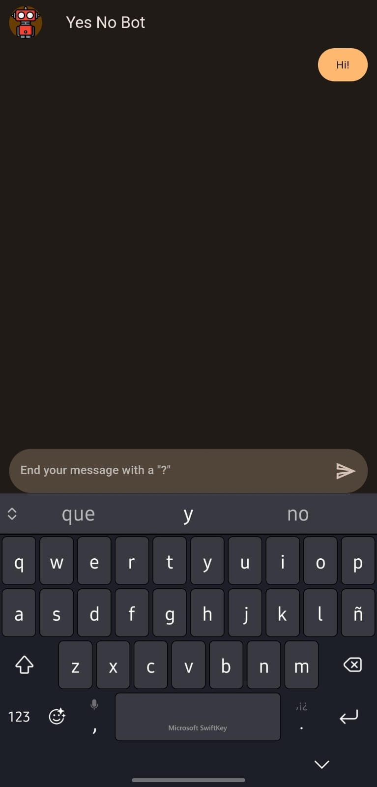
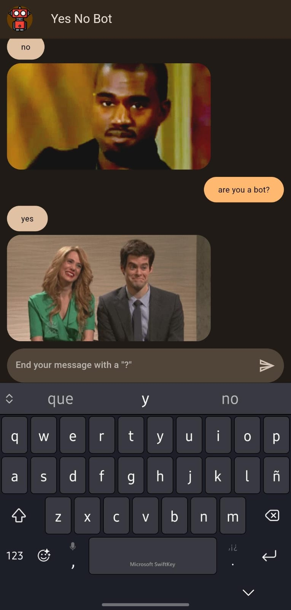
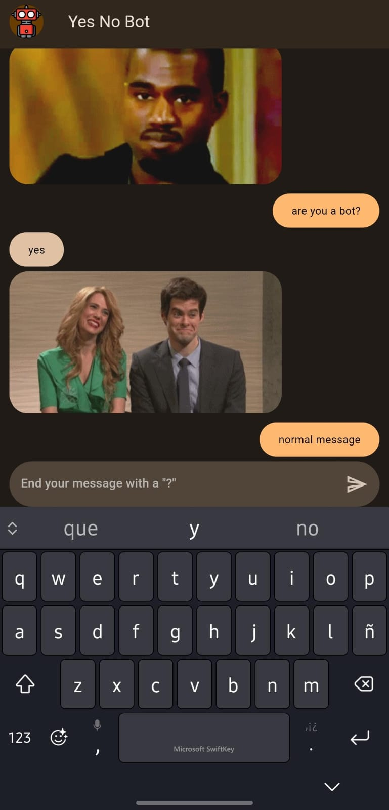
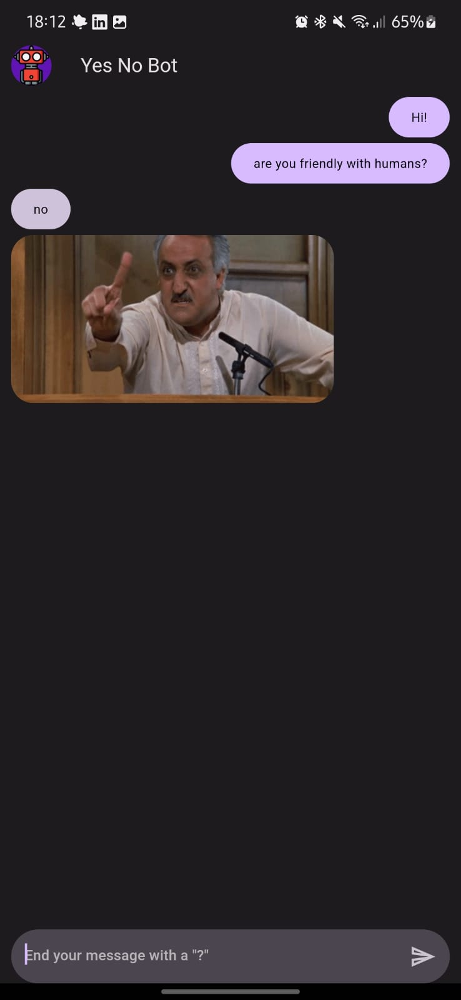
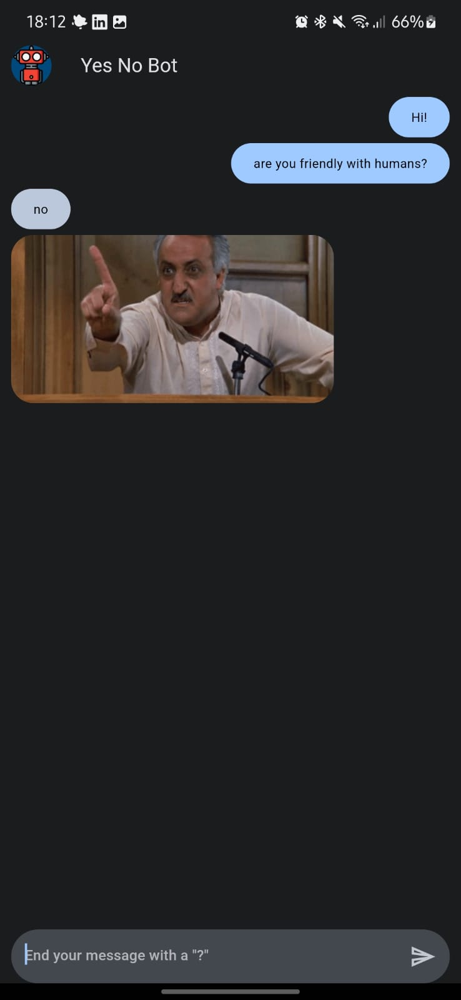
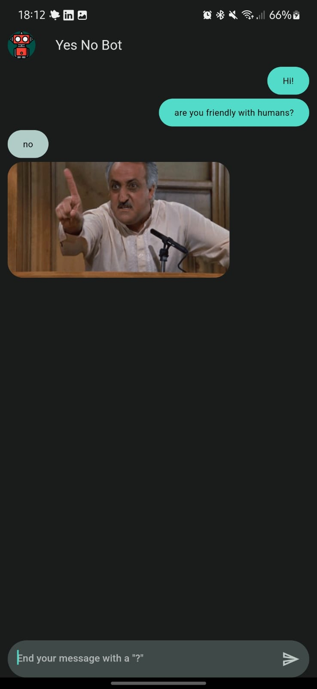

# yes_no_app

## Table of contents
- [Description](#description)
- [Screenshots](#screenshots)
    - [First State](#first-state)
    - [Ask Question](#ask-question)
    - [Normal message](#normal-message)
    - [Multiple Themes](#multiple-themes)

## Description

This app was made in my process of learning Flutter. It simulates a bot that makes an HTTP request to the [Yes No WTF API](https://yesno.wtf/api) and shows the response along with the GIF image in the chat.

## Screenshots

### First state

### Ask question

### Normal Message

### Multiple Themes

